Let’s go through an example of using Side-Eye to investigate an issue. We’ll use
a toy service and do a walk through using the debugger to understand a problem.
Once we’re satisfied with understanding the problem, we’ll briefly show how a
debugging session can leave something durable behind it so that future issues
are diagnosed quicker. The example code lives in
[side-eye-demos/slow-rpc](https://github.com/DataExMachina-dev/side-eye-demos/tree/main/slow-rpc).
The example is a simple gRPC server that stores state on behalf of an arbitrary
number of clients. There is also a [client
program](https://github.com/DataExMachina-dev/side-eye-demos/blob/f29ecfdda0b1cf6374417bcc3111bb6be87b6ff1/slow-rpc/client/client.go)
consisting of 100 goroutines making requests to the server in a loop; each
goroutine corresponds to a logical client, as identified by a “clientID”
(numbers from 0 to 99). Each
[GetInfo](https://github.com/DataExMachina-dev/side-eye-demos/blob/f29ecfdda0b1cf6374417bcc3111bb6be87b6ff1/slow-rpc/server/rpcpb/rpc.proto#L19)
request is asking the server for data attached to the respective clientID.

If we were to run the client program locally, we'll see that, every now and
then, it prints a log message complaining that an RPC took a very long time -
over a minute. Not all RPCs take a long time, though. Our mission here is to
figure out why some do.

The broad strategy is the following:

* We’ll use Side-Eye to take a snapshot of our system at an arbitrary time.
* We’ll look in the snapshot and try to identify a client- and server-side
  goroutines corresponding to one of these slow RPCs.
* If we do find such a goroutine, we’ll look at their stack trace and see what
  they’re doing / what they’re blocked on. Depending on that, we’ll judge
  whether what we’re seeing in that one specific snapshot is likely to be
  representative of all the slow RPCs, or if it looks like there might be more
  than one problem.
* Then, depending on what the goroutines are blocked on, we’ll see if we can
  follow up with a deeper question about what else in the system we should be
  looking at towards a complete root cause.

To take a snapshot, we need the client and server to be running, and we need the
Side-Eye agent to be running on the respective machine(s). We have a sandbox
environment set up for this, accessible at <a
href="https://demo-raw.app.side-eye.io">demo-raw.app.side-eye.io</a> – this is
the Side-Eye web app connected to one agent running on a VM with our client and
server. There is also <a href="demo.app.side-eye.io">demo.app.side-eye.io</a> –
a demo environment that monitors the same processes but where Side-Eye has
already been configured to collect all the data that we’ll require in this
tutorial. If you get lost or want to skip ahead, you can use that one to see the
end state.

Once we’re in the sandbox, the first thing we need to do is take a snapshot of
the processes we’re interested in. By expanding the arrow on the “Capture
snapshot” button at the top-right, we can verify that indeed the agent is
monitoring our two processes.

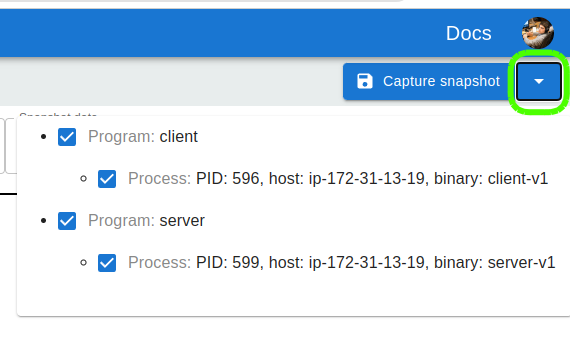


Let’s click the button and capture a snapshot. After a moment, we get a
notification telling us that the new snapshot can now be opened. The new
snapshot also appears on the Snapshots page. Opening the snapshot, we get a
flame graph view of (the stack traces of) all the goroutines, across our two
processes. This includes goroutines that were executing on-CPU at the moment
when the snapshot was captured, and goroutines that were blocked or waiting to
be scheduled.

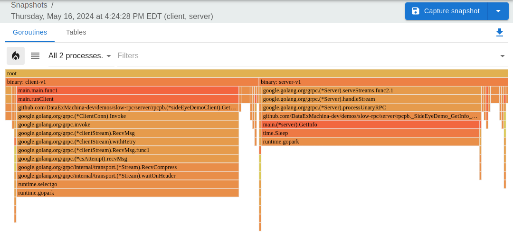

Each cell in the flame graph corresponds to a stack frame from a group of
goroutines with similar stacks. The width of a cell corresponds to the number of
goroutines whose stack matches from the top-most frame to that cell. In our
example, we notice two wide columns – one under `binary: client-v1` containing
the function `main.runClient` and one under `binary: server-v1` containing the
method `main.(*server).GetInfo`. Hovering over cells in these stacks, we see
that each column corresponds to 100 goroutines. This makes sense: at any point
in time (in particular, at the moment this snapshot was captured), we expect 100
client-side goroutines blocked on RPCs to the server (those are the `client-v1`
stacks), and 100 server-side goroutines handling those requests (the `server-v1`
stacks).

We know that some RPCs take 1 minute (which is very long) so, hopefully, at the
time of the snapshot there is such a slow RPC in-flight (or maybe multiple of
them?). Cross-checking the client-side stack trace with the [source
code](https://github.com/DataExMachina-dev/side-eye-demos/blob/f29ecfdda0b1cf6374417bcc3111bb6be87b6ff1/slow-rpc/client/client.go#L38-L50),
we see that the `runClient` calls `rpcClient.GetInfo` in a loop. The first
question is – can we get our hands on a slow `GetInfo` request (i.e. a `GetInfo`
request that has been blocked for a while)? We could attempt several ways of
answering this; one way is to click on the GetInfo cell in the flame graph in
order to focus the visualization on goroutines that have a specific stack
prefix, and then to switch to the stacks view that has more info on the
goroutines.

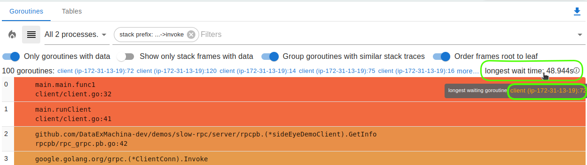

On the stacks view, goroutines with identical stack traces are grouped together.
Since we focused on the 100 goroutines that are doing the same thing, we see
only one group. For each group, we can see how many goroutines there are in it,
and the time that the longest-blocked goroutine has been waiting for. Hovering
over the “longest wait time” text gives us a link to the respective goroutine.
So, if we are interested specifically in the longest-blocked goroutine in a
group, then clicking that link will focus us on the oldest goroutine. If we care
about the blocking times of other goroutines, Side-Eye exposes that data in a
built-in SQL table; we’ll get to tables in a bit.

If we follow the link to the longest waiting goroutine, our view will be
filtered to that one goroutine (see the filters box). The stack that we see in
the stack view and in the flame-graph view is the same as before – we’ve
selected one of 100 goroutines with identical stack traces. The stack trace is
telling us that the goroutine is waiting on an RPC request. But, crucially, we
now see the data collected from this one specific goroutine. When starting from
an empty “spec”, like this raw-demo sandbox does, not much data is collected
(we’re about to collect more in a bit). However, Side-Eye recognizes gRPC calls
out of the box and collects enough data to allow navigation from the client-side
of a call to the server-side. This will allow us to figure out what the server
is doing.

Looking at the stack frame corresponding to the
`google.golang.org/grpc.(*csAttempt).recvMsg` function, we see link icons next to
the `stream_id` and `local_addr` variables. Clicking on one of those shows a little
popup that invites us to navigate to the server-side goroutine handling this RPC
request. Either of the two link icons works; they do the same thing because both
stream_id and local_addr participate in the same links.


Following the goroutine link in the popup gets us to the server-side goroutine.
Let’s see what the server is doing.

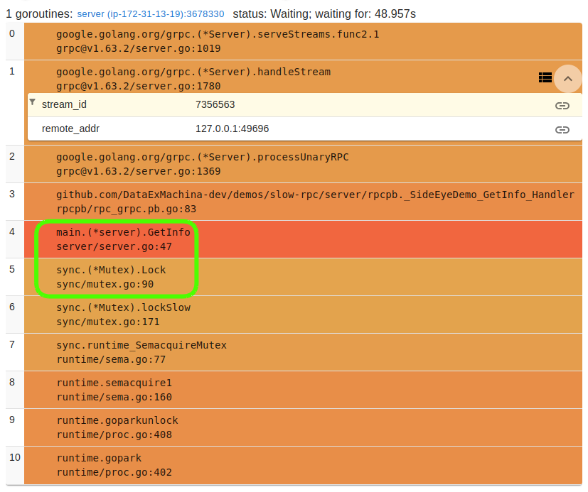

We notice that this goroutine has also been waiting for a similar amount of time
to the client-side goroutine, which is not too surprising. From the
`sync.(*Mutex).Lock` frame, it looks like we’re blocked on acquiring a mutex.
The question now is – who’s holding that mutex and why are they holding it for
so long. Also note  that, towards the top of the stack, the
`grpc.(*Server).handleStream` frame has the link icon on its variables. This is
the server-side to client-side link, the reverse of the one we’ve followed to
get to this goroutine; Side-Eye links are bidirectional.

At this point, we could inspect the code and speculate about who might be
holding the lock. Or, we can try collecting some information from this
server-side goroutine. In particular, we can focus on our RPC handler:
main.(*server).GetInfo. Hovering over a stack frame displays two buttons; one of
them shows the side-bar where we can edit the function spec to collect more data
(we can also Alt-Click on the frame’s function name like we did on the flame
graph view).

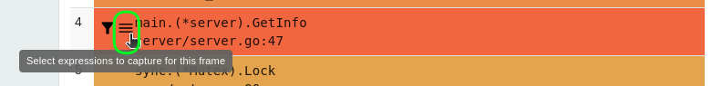

This will bring in a sidebar displaying details for the function. We call this
the “function spec” – it specifies what data to collect when this function is
encountered as a frame on a goroutine’s stack. Clicking “Add/remove variables”
shows all the variables in the function and lets you select which ones should be
captured and included in future snapshots.

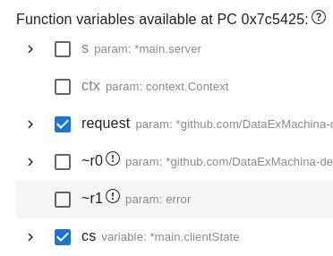

Not all variables are always available for capturing. In particular, when
editing a function spec in the context of a particular goroutine’s stack frame
(or a group of goroutines with matching stacks, like we display in the flame
graph), the availability of variables is considered relative to that frame’s
code location (i.e. the frame’s program counter). That’s what “variables
available at PC 0x7d1603” is saying. Some of the function’s variables are not in
scope at that code location, for example. Such unavailable variables are grayed
out in the form (note however that the collection of unavailable variables can
still be requested; if a frame corresponding to our function is found at a
different PC where the variable is available, it will be collected in that
frame’s context).

Let’s select the variables that look interesting: the request protobuf and the
`*main.clientState`. The latter is the structure that contains the mutex we’re
blocked on, so it seems like a good idea to see what else is in there.

To get newly requested variables, we need to capture another snapshot. Let’s do
that and see if there is anything interesting in the `clientState` struct that
we asked for. Note that the new snapshot will likely have another slow RPC,  so
we have to find the oldest client-side request again and navigate to the
server-side handler. Or, to take a shortcut, after opening the new snapshot, we
can go back to the flame graph and focus on the server-side goroutines; we’ll
notice that there are exactly two distinct stack traces for the server-side
goroutines: 99 goroutines are blocked on a time.Sleep() call, and one is blocked
on `Mutex.Lock`. We want to focus on the latter.

Let’s look at the data that we just collected for this goroutine. 


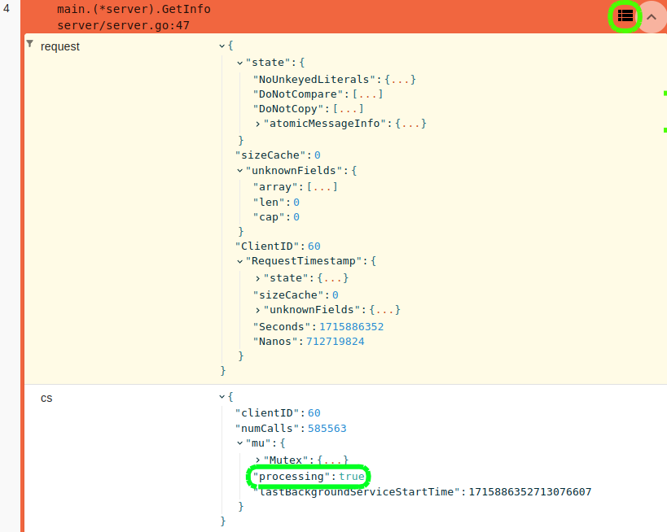

In the stacks view, captured variables are displayed inline, within the stack
frame from which they were captured. Both the `cs` and the `request` variables
are of struct type; they both contain a `clientID` field identifying the client
performing the request. There's something suspicious in the `cs`
variable: one of the fields says `processing: true`. Could this
“processing” be a clue about who’s currently holding the mutex?

To attempt to quickly disprove the theory that the `processing: true` flag is
interesting, we can check whether that field is set for any of the other
in-flight requests. Clicking on the table icon in the top-right corner of the
`main.(*server).GetInfo` stack frame will open up a table containing all the
data collected from `server.GetInfo`; each stack frame from the snapshot
corresponding to this function, across all goroutines, is represented as a row.
Side-Eye organizes all the collected data into SQL tables, and lets you query
them and create derived tables for processing and analyzing the data. In
particular, every function from which we capture some variables gets a “function
table”.

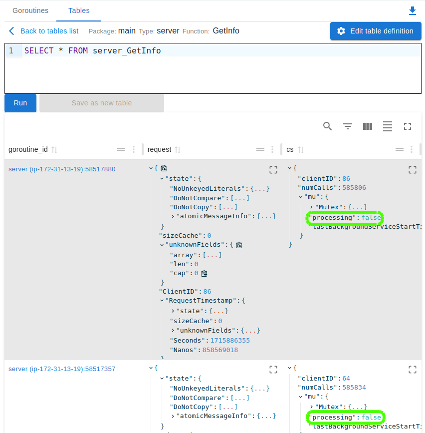

Eye-balling the data in the `cs` column, we see that the `processing` flag seems
to generally be `false`. In order to verify that there is only one row where the
flag is set, we can change the pre-populated query at the top to
```SQL
SELECT * FROM server_GetInfo where cs->’mu.processing’ = 'true'
```
and hit Run (or Ctrl-Enter); we’ll see that, indeed, there is only one result
row, and it corresponds to the goroutine handling our slow request. So, the
`processing` field seems correlated to our issue.

Going to the code again, we can check who sets the `cs.mu.processing` field: the
[server.processClient](https://github.com/DataExMachina-dev/side-eye-demos/blob/05053eab60d0d2949fdaa16fe3d58acccf85c325/slow-rpc/server/server.go#L98)
method. Reading that method’s code, we get a pretty good idea about what’s going
on: `processClient` takes the mutex of a `clientState` object and holds it for
one minute (this is supposed to simulate a slow computation). Let’s verify in
Side-Eye that `processClient` is indeed running. Go back to the Goroutines tab
and type `processClient`, for example, in the filter box. Select the suggested
method to filter the view to goroutines that have this function somewhere on
their stack trace. We find one such goroutine: `server.processClient` is called
by `server.backgroundProcessor`, so we gather that the lock is held on behalf of
some background processing.

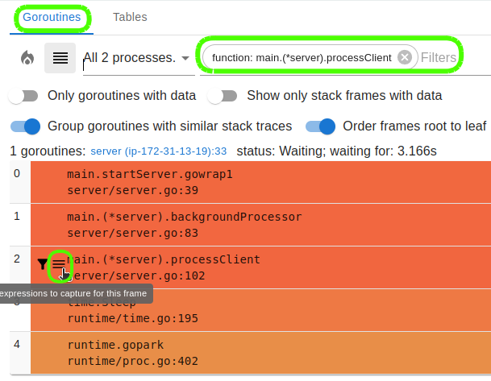

Let’s verify that this goroutine is working on the same `clientID` as the one
that the RPC handler is trying to lock: let’s capture the `cs` variable from
`(*server).processClient`.

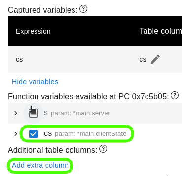

Also, let’s add an “extra column” called `last_background_service_time` to the
function’s table with the expression `cs->'mu.lastBackgroundServiceStartTime'`.
This will tell us how long the background processing has been running for. Extra
columns allow adding columns to function tables that do not correspond directly
to a captured variable. An extra column is defined by a SQL expression evaluated
on top of the “captured variable” columns; these expressions are frequently JSON
path expressions using SQLite’s `->` JSON operator for selecting specific fields
of a captured variable. In this case, we're selecting a numeric field whose unit
is nanoseconds since epoch; set the column type to `TimestampNanos` so Side-Eye
interprets the timestamp accordingly and formats it nicely.

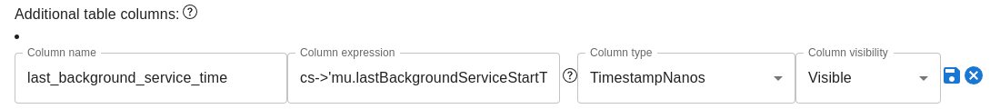

Since we just requested new data to be collected (i.e. the `cs` variable),
we need to capture a new snapshot for the new data to be included. Click the
"Capture snapshot" button and notice that, when we open the new
snapshot from the toast notification that appears at the top of the page, the
Goroutines view will retain its filters. So, we’ll automatically be focused on
the goroutine running `processClient` (this might be a different goroutine than in
the previous snapshot that we were looking at). Now we’ll get a `clientID` value
which we can verify that it corresponds to the currently-running slow request.
We also get a value for our `last_background_service_time` column which tells us
that `processClient` has started its processing a few seconds ago, which
corresponds roughly to when our current slow request got blocked.

To pedantically prove that this processClient call is holding the mutex that the
gRPC handler is trying to acquire, we can look at the memory address of the
`clientState` struct that contains the mutex and observe that it’s the same across
the two functions. Both `server.GetInfo` and `server.processClient` have a pointer
to the `clientState`. Side-Eye does not show pointer values by default, but we can
still get them. Whenever we capture a variable, the function table for the respective
function gets a column with the variable’s name containing a JSON representation
of the variable’s data. This representation flattens pointers (i.e. there is no
difference between how pointer fields and non-pointer fields are rendered).
However, there is also another column called `raw_<variable name>` that
doesn’t do the flattening; that one contains pointer values. This column is
hidden by default, but we can ask for it to be shown in the table view. Navigate
to the `processClient` table (by clicking on the table icon corresponding to a
`processClient` frame in the stacks view, or by switching to the Tables view at
the top of the page). To show hidden columns, click on the “Show/hide columns”
button on top of the table’s data and toggle the `raw_cs` column.

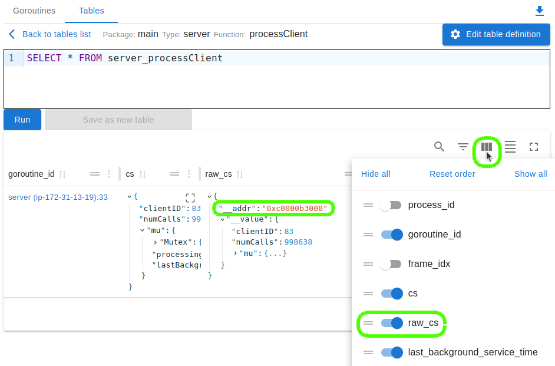

We now see that the data we captured was a pointer, and we get the value of the
pointer in the `__addr` field. To check whether this memory address corresponds
to the pointer in `server.GetInfo`, one easy thing to do is copy the memory
address, and then do a “full-text search” to see if that address appears
anywhere else in the data. Navigate to the Tables view at the top, then click on
`all_captured_data` table. `all_captured_data` is a built-in table (technically,
it’s a database view) that presents all the data from all the other function
tables in a uniform way. It’s particularly useful for this “full-text search”
functionality.

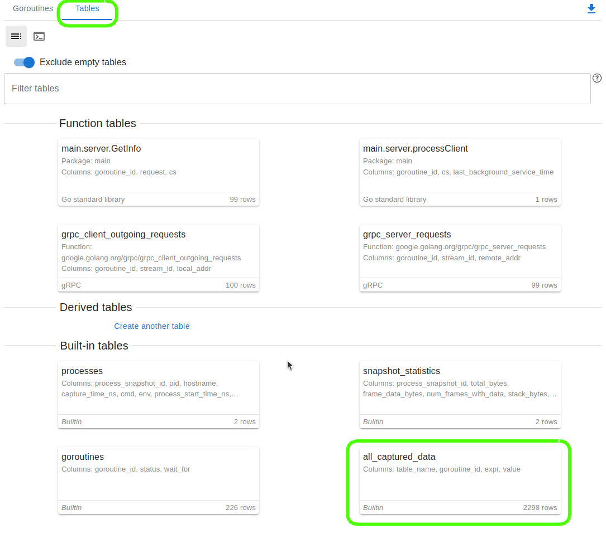

With the `all_captured_data` table open, we can click on the magnifying glass icon
to do a text search through all the data. Pasting the memory address in there
gives us two results: one in table `server_processClient` (this is the table
corresponding to the `server.processClient` method where we got the memory
address from), and the other one in table `server_GetInfo`, corresponding to the
gRPC handler. So, everything checks out – the `cs` variable in the handler points
to the same `clientState` object. We can use the link in the `goroutine_id` column
to navigate to our blocked handler goroutine, coming full circle.

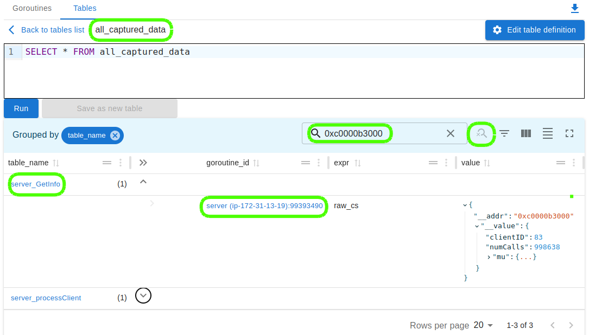

We have figured out in pretty good detail what’s going on. To recap, we wanted
to understand why some RPCs are slow. We followed a few steps that should become
second nature after using Side-Eye a few times:

1. We started on the client side by collecting all the gRPC request protos. We
   identified the goroutine that was blocked the longest; the blocking time was
   quite large, so our snapshot was taken at a time when a “slow RPC” was in
   progress.
2. We then used the gRPC links to navigate from the client-side goroutine to the
   server-side one, where we saw that the server is blocked on a mutex.
3. We then collected some data from server.GetInfo about what the server is
   doing to get a clue about what the contended mutex is about.
4. We cross-referenced the code to see who else is locking that mutex. We found
   one other method that does (server.processClient), and so we searched the
   stacks to see if that method is running; it was running indeed.
5. We then collected data from server.processClient to check on the state around
   the mutex it’s holding and verify that it’s indeed the same one as the one
   that the gRPC handler is trying to lock.

This was a pretty satisfying investigation; it’s a toy example, but it shows how
one can dig pretty deep with Side-Eye towards a root cause. Besides letting you
spelunk deeper than other tools, the other power of Side-Eye is making future
related investigations by you or others in the team easier - future
investigations don’t need to start from scratch. Reusing prior work take a
couple of forms:

* the data that we asked for and the extra columns we defined for function table
  will remain for the benefit of future snapshots (so, for example, future
  investigations can now start by looking at all active RPC requests and select
  the oldest)
* derived tables can be created for reports that do not directly correspond to
  stack frames
* links can be defined for easy navigation between entities

To help our future selves, let’s create a link between a `server.GetInfo` frame
and the `server.processClient` frame that it’s blocked on (if any). Next time
this relationship is needed, we’ll be able to move from goroutine/frame to the
other naturally (similarly to how we've used the built-in gRPC link to navigate
from client to server). The link will also function the other way around:
`server.processClient` can also be blocked by `server.GetInfo`, albeit for less
time.

Side-Eye links are a powerful, general concept – a table row can be linked to
other table rows. The links do not carry semantic meaning as far as Side-Eye is
concerned, but they can be given a description. A link consists of one or more
columns from a source table, and an equal number of columns in a target table.
Links are bidirectional, so the source and target are symmetric. A link between
`(table A: column foo)` and `(table B: column bar)` means that a row from `A`
with value `x` in column `foo` will be linked to any row from `B` that has value
`x` in column `bar`. These links show up when visualizing table `A` and table
`B`. If either of these are function tables (so their rows correspond to stack
frames), then the links also show up when looking at stack traces that contain
those frames on the stacks view.

Before defining our link, we need to decide what exactly is the key that makes
the connection between the `server.GetInfo` frame and the
`server.processClient`. We have a couple of options:
- We could use the `cs` columns on both sides, but that does not please our
  sensibilities: the `cs` columns contain possibly-large JSON documents and
  using the JSON representation of a data structure as the identity of the
  respective structure seems unusual and perhaps fragile (although it would work
  for our purposes).
- We could use the `ClientID` field, as it uniquely identifies the `clientState`
  instance that both those functions are operating on.
- We could use the memory address of the `clientState` struct. This is arguably
  the most direct way to express the relationship that we're trying to get at
  with our link: two different function are contending trying to operate on the
  same object. Let's take this option.

Once we know conceptually what we want to join the tables on, we need a column
(or a combination of columns) in each of the tables that contain our key (and
only our key). Similarly to how we added the `last_background_service_time`
column before, let’s navigate to the table corresponding to the `server.GetInfo`
function and add our memory address column, and then navigate to the table
corresponding to the `server.processClient` function and do the same thing.


Navigate to each of the tables and click “Edit table definition”.

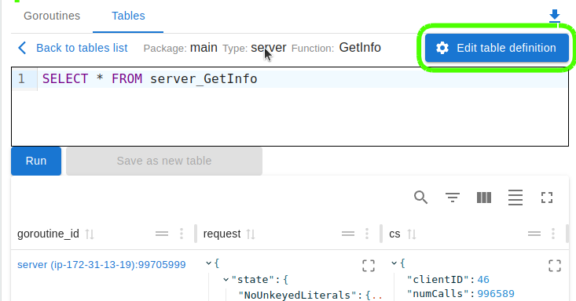

Now add an extra column called `cs_addr` with the expression `raw_cs->'__addr'`.

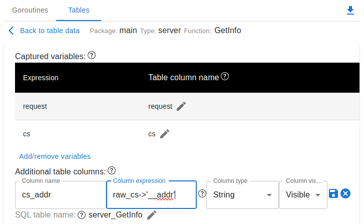

With these columns, we’re now ready to add a new link to our spec. To define a
new link, navigate to the Spec page and add a new link referencing the two tables,
each with the column we've just defined.

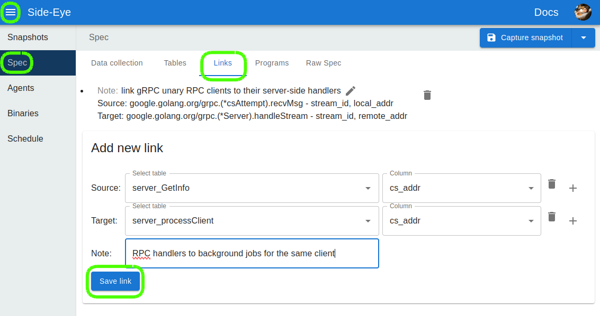

Once we add the link to the spec, we can go back to the Snapshots tab, open our
last snapshot, and navigate to our tables or stacks and see the link icons for
the respective frames. Note that we don’t need to capture a new snapshot for the
new links to be reflected, just like we didn’t need a new snapshot for the extra
columns to appear in their tables: the data in existing snapshots is always
organized and link-ified according to the current version of the spec. For
example, if we navigate to `server.processClient`’s table, the one and only row
there now gets a link icon in the `cs_addr` column.

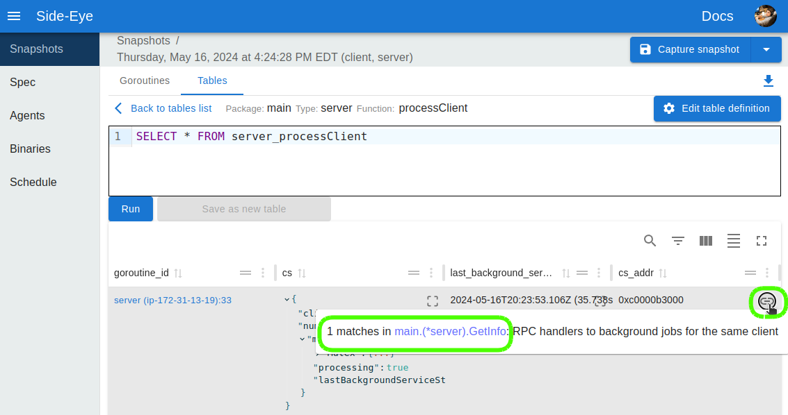

Similarly, rows in `server.GetInfo`’s table will now get links, although over
there only one of the 100 rows gets the link – the row corresponding to the
goroutine that’s blocked by the background job.

The links also show up in stack traces of the respective goroutines:

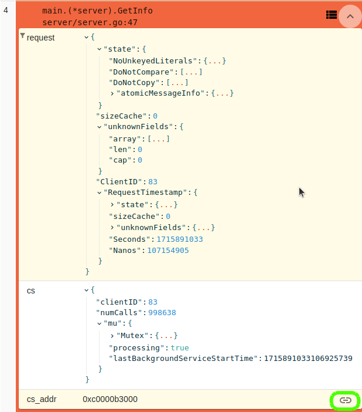

This concludes the walkthrough. The point was to present a debugging flow on a
toy example, and introduce some of Side-Eye’s features geared towards use in a
team, across time. Thanks for playing.
